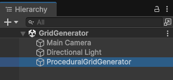
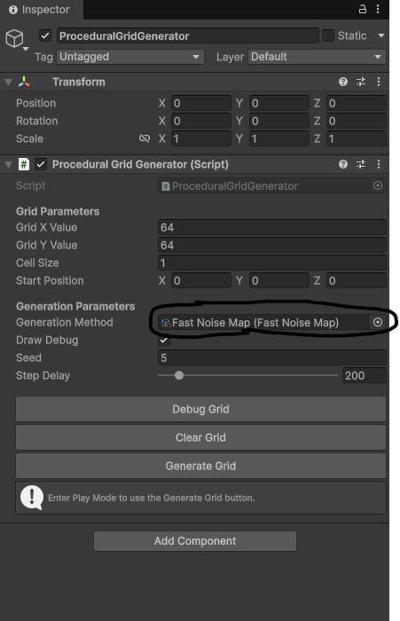
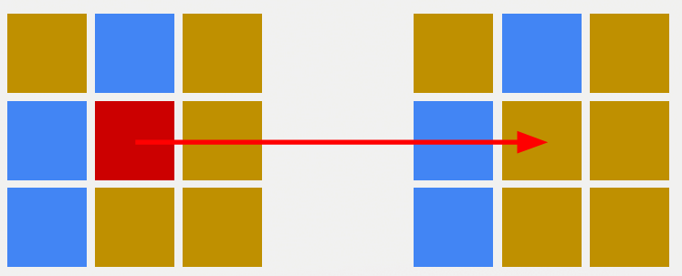
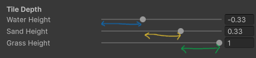

# Documentation of Procedural Programmation

> To access file code: Open the "Components>ProceduralGeneration" folder.

- [How-it-Works](#How-it-Works)
- [Dungeon-Parts](#Dungeon-Parts)
- [Random-Map-Generator](#Random-Map-Generator)

## How it works
• The ProceduralGridGenerator contains the main algortithm.
 

_ApplyGeneration()_ is used to create your Initialize your Procedural Programm.
 

You have to create a ScriptableObject in order to make your program.
You can choose existing Procedural Program via Assets/Components/Procedural Generation

• You can change the Script by Drag and Drop here depending on your procedural generation method. 

  

## Dungeons Parts
### • Simple Room Placement
  This algorithms generates random square into a square with defined length and width,
  and make the paths between rooms.

> TO DO: Link the room between them.

### • Binary Space Partition
  The core idea of BSP is to break down a complex space (for example, a 2D or 3D environment) into smaller, more manageable regions. This division is done recursively by choosing a plane (in 3D) or a line (in 2D) that splits the space into two parts:

_Code Made by Yona Rutkowski_

## • Random Map Generator
### • Cellular Automata
  Generation of random pixels in the map, and according to the 8 pixels all around, change the pixel. 

  

### • Noise
<ins>**Definition**</ins>  
Procedural noise is a mathematical technique used to generate natural-looking randomness in computer graphics, simulations, and procedural content generation. Unlike pure random values, noise functions produce smooth, continuous variations, making them ideal for creating textures, terrains, clouds, and other organic patterns.

<ins>**Principle**</ins>  
The idea behind procedural noise is to generate pseudo-random values based on spatial coordinates (e.g., x, y, z). These values are computed using deterministic mathematical functions, meaning the same input will always produce the same output.
The result is a continuous field of values that change gradually over space — giving a natural, non-repetitive look.

The Noise system is based on this project: 
<a href="[url](https://github.com/Auburn/FastNoiseLite)">https://github.com/Auburn/FastNoiseLite</a>

**• How Tile Depth Works** 
   
Tile Depth is a range between -1 to +1, it'll defined the occurrence of the tile.
 
First Tile Depth is between -1f to the defined range.
 
The last Tiel Depth will be between the defined range to +1f.
   

